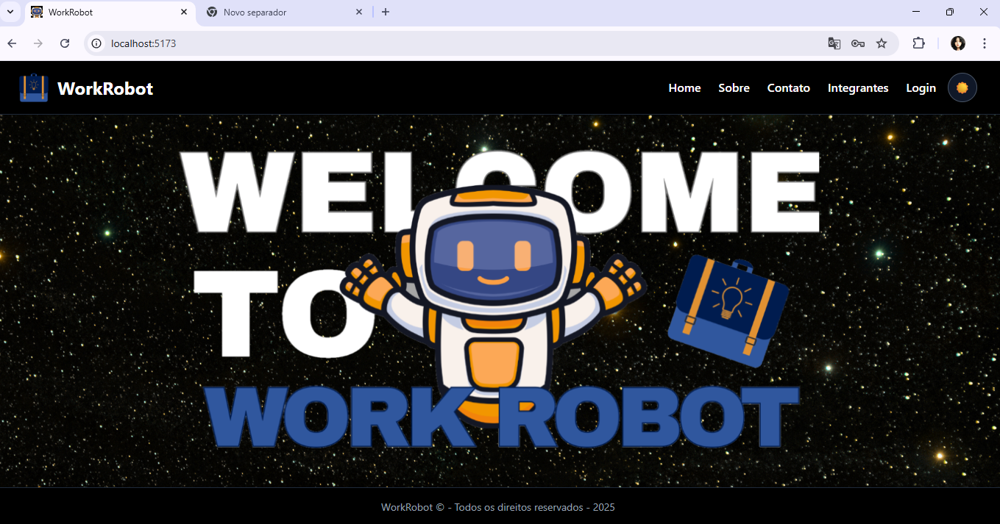
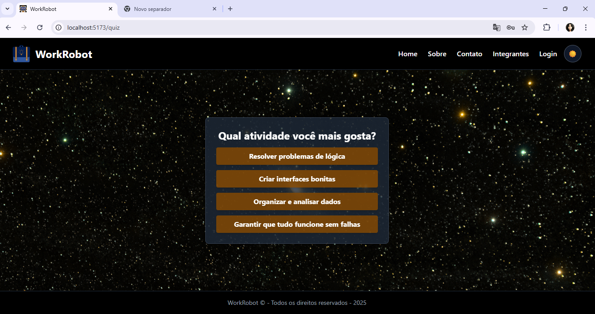
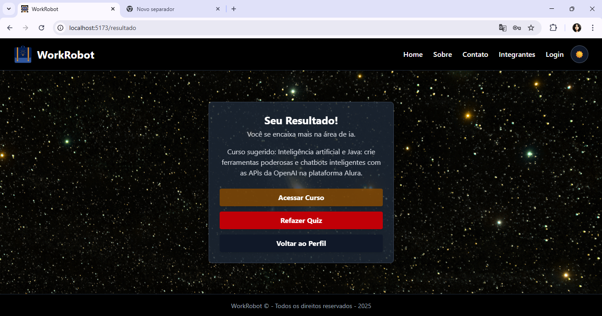

## 🤖 WorkRobot 

## 📝 Descrição
O **WorkRobot** é uma plataforma web que auxilia pessoas a descobrirem áreas profissionais e cursos adequados ao seu perfil e interesses.  
Através de um quiz interativo, o usuário recebe recomendações personalizadas de cursos e carreiras, facilitando escolhas para o futuro profissional.


## 📊 Status do Projeto
**Status:** Concluido

---

## 📚 Sumário
- [Sobre o Projeto](#sobre-o-projeto)  
- [Tecnologias Utilizadas](#🛠-tecnologias-utilizadas)  
- [Funcionalidades Principais](#⚙️-funcionalidades-principais)  
- [Instalação](#⚙️-instalação)  
- [Como Usar](#🚀-como-usar)  
- [Estrutura do Projeto](#📂-estrutura-do-projeto)  
- [Rotas Principais](#🔗-rotas-principais)  
- [Autores e Créditos](#👥-autores-e-créditos)  
- [Screenshots / Demonstração](#🖼-screenshots--demonstração)  
- [Contato](#📫-contato)  
- [Links](#🔗-links)


---

## 💡 Sobre o Projeto

O **WorkRobot** é uma plataforma web desenvolvida para **ajudar pessoas a descobrirem novas áreas profissionais** e cursos de acordo com seu perfil e interesses.  
O sistema permite que o usuário crie uma conta, responda a um **quiz interativo sobre habilidades e preferências** e receba recomendações de **cursos e trilhas profissionais em alta no mercado**.

A proposta é simples e consciente: **preparar jovens e profissionais para o futuro do trabalho**, utilizando tecnologia e inovação para criar uma experiência de aprendizado personalizada e acessível.

---

## 🛠 Tecnologias Utilizadas
- **Front-end:** React + TypeScript  
- **Back-end:** Supabase 
- **Banco de Dados:** SQL  
- **Hospedagem / Infraestrutura:**Vercel 
- **Controle de versão:** Git + GitHub


---

## ⚙️ Funcionalidades Principais

- 📝 **Quiz Interativo:** identifica interesses, habilidades e preferências do usuário.  
- 🎯 **Sugestão de Cursos e Carreiras:** recomenda carreira e cursos alinhados ao perfil do usuário.  
- 👤 **Cadastro e Login:** criação de conta e autenticação segura.  
- 🌐 **Interface Responsiva e Acessível:** adaptação para diversos dispositivos e inclusão digital.  
- 📊 **Feedback de Resultados:** apresenta relatórios de habilidades e áreas de interesse do usuário.  

---

## ⚙️ Instalação
Siga os passos abaixo para configurar o projeto localmente:
```bash
1. Clone o repositório:
git clone https://github.com/WorkRobot/Global-Solution.git

2. Acesse a página do projeto
cd workrobot

3. Instale as dependências do front-end
npm i

4. Execute o projeto
npm run dev

5. Abra a aplicação
o

```
## 🚀 Como Usar

- Abra o navegador e acesse a aplicação
- Explore as funcionalidades do site
- Crie uma conta ou faça login.
- Responda ao quiz interativo para receber recomendações personalizadas de cursos.

Você pode acessar a aplicação pelo vercel:
---

## 📂 Estrutura do Projeto

```bash
📦 work-robot/
├── src/
│   ├── 📂 assets/        # Imagens e ícones 
│   ├── 📂 components/    # Componentes reutilizáveis
│   ├── 📂 context/       # Contextos de tema
│   ├── 📂 routes/        # Páginas e rotas principais
│   ├── 📜 App.tsx        # Controle principal das rotas
│   ├── 📜 main.tsx       # Renderização do App no DOM
│   ├── 📜 global.css     # Estilos globais
├── 📜 services/          # Chamadas à API e integração backend
├── 📜 package.json       # Dependências e scripts
├── 📜 vite.config.ts     # Configuração do Vite
├── 📜 .env               # Variáveis de ambiente (URLs, tokens)
└── 📜 README.md
```
---

## 🔗 Rotas Principais

- **`/`** – Página principal do sistema (`Home`).  
- **`/sobre`** – Página "Sobre o Projeto" (`Sobre`).  
- **`/contato`** – Página de contato (`Contato`).  
- **`/integrantes`** – Página com informações sobre os integrantes do projeto (`Integrantes`).  
- **`/cadastro`** – Tela de cadastro de novos usuários (`Cadastro`).  
- **`/login`** – Tela de login (`Login`).  
- **`/logado`** – Tela do usuário logado com informações personalizadas (`Logado`).  
- **`/quiz`** – Página do quiz interativo para descobrir áreas profissionais (`Quiz`).  
- **`/editar`** – Tela para editar informações do usuário (`Editar`).  
- **`/deletar`** – Tela para deletar conta ou dados do usuário (`Deletar`).  
- **`/resultado`** – Tela que mostra o resultado do quiz e recomendações (`Resultado`). 
- **`/faq`** – Página de Perguntas Frequentes (`FAQ`).  
- **`*`** – Página de erro para rotas não encontradas (`Error`).

---

## 👥 Autores e Créditos

- **Amandha Yumi Toyota Artulino** – RM: 563549  
- **Giovanna Bardella Gomes** – RM: 561439  
- **Erick Takeshi Nakajune** – RM: 566059

---

## 🖼 Screenshots / Demonstração

### Tela Inicial


### Quiz Interativo


### Resultado do Quiz


---

## 📫 Contato

Você pode entrar em contato com os integrantes do projeto:

- **Amandha Yumi Toyota Artulino** – RM: 563549 – Turma: 1TDSPJ  
    
  [LinkedIn](https://www.linkedin.com/in/amandhayumitoyotaartulino) | [GitHub](https://github.com/AmandhaYumi)

- **Giovanna Bardella Gomes** – RM: 561439 – Turma: 1TDSPJ  
    
  [LinkedIn](https://www.linkedin.com/in/giovanna-bardella-gomes-950082365) | [GitHub](https://github.com/nanabardella)

- **Erick Takeshi Andrade Nakajune** – RM: 566059 – Turma: 1TDSPJ  
    
  [LinkedIn](https://br.linkedin.com/in/erick-nakajune-07815a348) | [GitHub](https://github.com/Etvtaeyo)

---
## 🔗 Links
- Link do Repositório: https://github.com/WorkRobot/Global-Solution
- Link do Youtube: https://youtu.be/hQCe3Ox3KmI?si=ZcpLb9BeC8NFHi5Q


---

  🧠 *Desenvolvido com dedicação pelo grupo WorkRobot - FIAP 2025.*